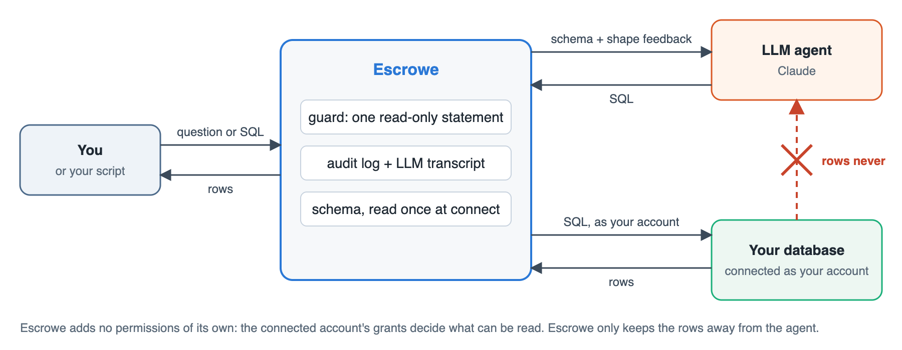

# Escrowe

<picture>
  <source media="(prefers-color-scheme: dark)" srcset="docs/01-overview-dark.png">
  
</picture>

Escrowe lets an LLM agent write SQL against your database without ever
seeing the data. It connects with a real database account, shows the agent
that account's schema (table and column names, types, comments, never
values), runs the SQL the agent writes as that account, and hands the rows
to you. The rows do not go back to the agent.

Escrowe adds no access control of its own: it does not grant the agent
anything the connected account cannot already do. What it does add is a
non-transformation policy - by default the agent may only run a single
`SELECT` (or `UNION`/`EXCEPT`/`INTERSECT`), never a write, a stored
procedure, or a file/environment read disguised as one - and the structural
guarantee that query results never re-enter the agent's context unless a
person explicitly feeds them back.

## How a question is answered

1. You connect a database account: `escrowe connect mysql://user:pw@host/shop`.
2. Escrowe reads the schema once, from the database's own system catalog.
   No `SELECT` is ever run against your tables to do this.
3. You ask a question. The agent proposes SQL from the schema alone.
4. A guard checks the SQL: one statement, read-only for the agent, no file
   writes, no stored procedures, no built-ins that read server files or
   stall the connection. Nothing is rewritten.
5. The query runs as your account. The rows come back to you. The agent may
   first "probe": run a query and get back only its shape (row count, which
   columns were all NULL) before finalizing.

Every attempt is written to a local audit log, and every prompt sent to the
LLM is written to a transcript you can inspect with `escrowe llm-log`.

## Install

With [pipx](https://pipx.pypa.io) (recommended: an isolated environment, and `escrowe` on your PATH):

```bash
pipx install "git+https://github.com/bureaugewas/Escrowe.git"
```

Or with pip, into your current environment:

```bash
pip install "git+https://github.com/bureaugewas/Escrowe.git"
```

Either way this clones and installs escrowe for you; you don't need a local
checkout first. Python 3.10 or newer.

To work on escrowe itself, clone it and install in editable mode instead —
see [CONTRIBUTING.md](CONTRIBUTING.md).

## Use

Guided: connect a database, connect an LLM, start asking.

```bash
escrowe
```

The same in the browser, with notebooks and charts:

```bash
escrowe -ui
```

Scripted:

```bash
escrowe connect mysql://user:pw@host:3306/shop
escrowe ask "how many orders shipped last week?" --local
escrowe sql "SELECT count(*) FROM orders" --local
escrowe meta --local
```

The password is never saved. A later `--local` command asks for it once, or
reads `ESCROWE_PASSWORD`.

### The LLM

Escrowe asks Claude or ChatGPT, and either one two ways:

```bash
escrowe llm login             # asks which, and how
escrowe claude login          # or go straight to one
escrowe chatgpt login
escrowe llm status            # which is connected, and how it bills
escrowe llm logout
```

| Vendor | Browser login | API key |
|---|---|---|
| Claude | Claude Code (`claude`) signs in to your Anthropic account | `ANTHROPIC_API_KEY`, or stored by the wizard |
| ChatGPT | Codex (`codex`) signs in to your ChatGPT account | `OPENAI_API_KEY`, or stored by the wizard |

The browser login reuses the subscription you already pay for and costs
nothing per question; an API key bills per token. When both are set up for a
vendor, the browser login wins unless you chose the key yourself. A stored
key lives in `~/.escrowe/escrowe.sqlite`, created readable only by you.

Inside the prompt: type a question, or `\sql <query>`, `\meta`, `\audit`,
`\export <file>`, `\json`, `\feed <question>` (experimental: ask about the
last result's own data), `\help`, `\q`.

### As a server

```bash
ESCROWE_API_ENABLED=1 escrowe serve
```

`user:pw` is not a separate server account - it is the same database
credentials each person already has (the ones you'd hand to `escrowe
connect`). The server does not store or issue its own passwords; login just
opens a real connection to the database as that person and keeps it as
their session. So a teammate logs in with the database account their DBA
already gave them, not with anything escrowe generates.

Then from another machine: `escrowe login`, `escrowe shell`, or Python:

```python
import escrowe
with escrowe.connect("escrowe://user:pw@host:8765") as conn:
    result = conn.ask("revenue per region this quarter")
    result.sql, result.rows, result.to_arrow()
```

Each login opens its own database connection as that person; sessions are
bearer tokens and the password is dropped after the connection opens.

## Databases

| Kind | Connection string | Driver |
|---|---|---|
| MySQL / MariaDB | `mysql://user:pw@host:3306/db` | PyMySQL |
| PostgreSQL | `postgres://user:pw@host:5432/db` | psycopg |
| SQL Server | `sqlserver://user:pw@host:1433/db` | pymssql |
| SQLite | `sqlite:/path/to/file.sqlite` | stdlib |
| DuckDB | `duckdb:/path/to/file.duckdb` | duckdb |
| DuckLake | `ducklake:/catalog.duckdb`, `ducklake:quack:host:port?token=…` | duckdb |

Adding a kind is one module in `escrowe/engines/` plus a registry entry; see
[CONTRIBUTING.md](CONTRIBUTING.md).

## Configuration

All of these are read automatically on every run - nothing extra to enable.
Escrowe reads its environment at startup (`load_settings()`), first loading
a `.env` file from the current directory if one exists, then one from
`~/.escrowe` (later files fill in only variables not already set, so a
value exported in your shell always wins). Anything you export in your
shell profile, or set in either `.env` file, applies with no further
configuration; unset variables just keep their default in the table below.

| Variable | Purpose |
|---|---|
| `ESCROWE_HOME` | Where state lives (default `~/.escrowe`) |
| `ESCROWE_LLM` | `auto` \| `anthropic` \| `openai` \| `claude-cli` \| `codex-cli` \| `mock` |
| `ESCROWE_MODEL` | Model name (default: the connected vendor's own, `claude-opus-5` or `gpt-6-astra`) |
| `ESCROWE_LLM_THINKING` | Extended-thinking budget (API-key providers only) |
| `ESCROWE_MAX_ROWS`, `ESCROWE_QUERY_TIMEOUT`, `ESCROWE_AGENT_ATTEMPTS` | Query and agent limits |
| `ESCROWE_API_ENABLED` | Allow `escrowe serve` |
| `ESCROWE_FEED_ENABLED` | Allow `\feed` (query results sent back to the LLM), default on |
| `ESCROWE_JWT_SECRET` | Session signing secret (generated if unset) |
| `ESCROWE_SERVER` | Default server URL for client commands |
| `ESCROWE_PASSWORD`, `ESCROWE_USER` | Credentials for scripted `--local` commands |
| `ANTHROPIC_API_KEY`, `OPENAI_API_KEY` | Use the API instead of a subscription |
| `CLAUDE_BIN`, `CODEX_BIN` | Where the vendor CLI lives, if not on `PATH` |

## Architecture

[docs/ARCHITECTURE.md](docs/ARCHITECTURE.md) walks from the big picture down
to what one question does, with diagrams at each level.

## Security model

Escrowe is not an authorization system. Connect an account scoped to exactly
what you are willing to let the agent read; the database's grants decide the
rest. What Escrowe adds is keeping data out of the agent's context: the agent
gets enough schema and shape information to write useful SQL and nothing
else. `tests/test_blind.py` and `tests/test_no_data_leaks.py` verify this.

## Development

```bash
pip install -e ".[dev]"
pytest          # fake in-memory engine; live engines via tests/docker/ (see tests/docker/README.md)
ruff check .
```

MIT licensed.
