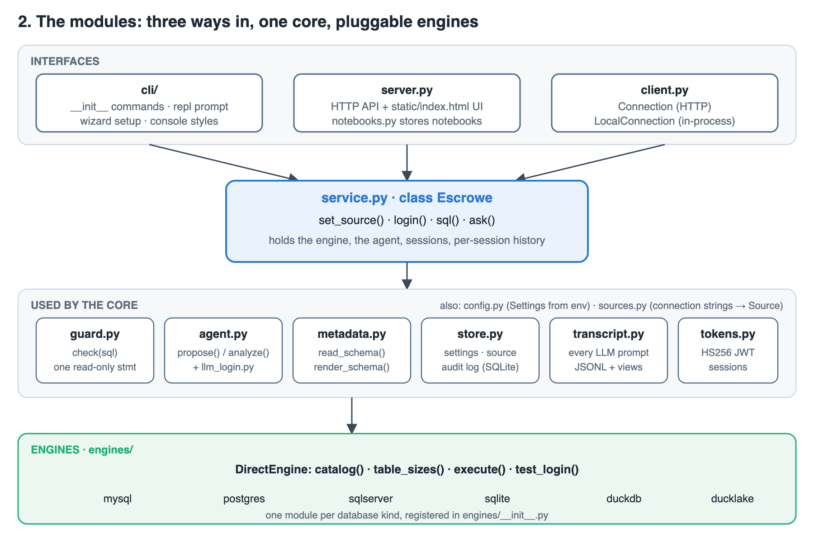
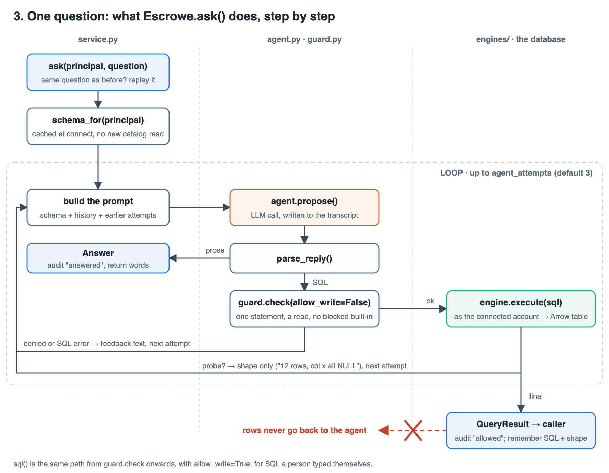
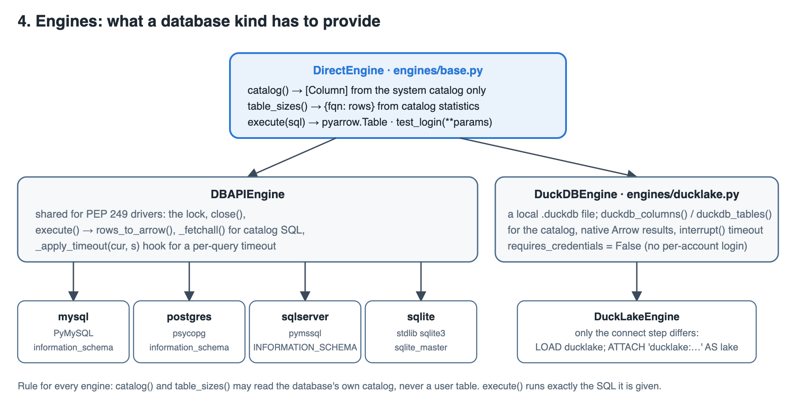

# How Escrowe works

Four levels, from the big picture down to one request. Each diagram is a
plain SVG in this folder, rendered to a light and a dark PNG.

## 1. Who sees what

<picture>
  <source media="(prefers-color-scheme: dark)" srcset="01-overview-dark.png">
  
</picture>

Three parties: you, the LLM agent, and your database. Escrowe sits between
them and enforces one asymmetry. The agent gets the schema and, when it
asks, the *shape* of a result (row count, which columns were all NULL). You
get the rows. The database is queried as your own account, so its grants
decide what is readable at all.

## 2. The modules

<picture>
  <source media="(prefers-color-scheme: dark)" srcset="02-modules-dark.png">
  
</picture>

There are three ways in and they all end at one object.

- **Interfaces** (`escrowe/cli/`, `escrowe/server.py`, `escrowe/client.py`)
  turn a terminal command, an HTTP request or a Python call into calls on
  `Escrowe`. They hold no logic of their own beyond input and output.
- **The core** (`escrowe/service.py`) is the `Escrowe` class: connect to a
  source, log people in, run SQL, answer a question. Read this file first.
- **Parts the core uses**, one job each:
  `guard.py` decides whether a statement may run; `agent.py` builds prompts,
  calls the LLM and parses the reply; `metadata.py` turns an engine's
  catalog into the schema text; `store.py` is the SQLite file with settings
  and the audit log; `transcript.py` records every prompt; `tokens.py`
  signs session tokens; `sources.py` parses connection strings; `config.py`
  reads settings from the environment.
- **Engines** (`escrowe/engines/`) are the only code that talks to a
  database. One module per kind.

## 3. One question, step by step

<picture>
  <source media="(prefers-color-scheme: dark)" srcset="03-ask-flow-dark.png">
  
</picture>

`Escrowe.ask()` in `service.py`:

1. If the same question was asked earlier this session, its result is
   replayed. No LLM call, no query.
2. The schema comes from a cache filled when the engine connected. Nothing
   the agent writes can trigger another catalog read.
3. The prompt is the schema, the session's earlier questions (their SQL and
   result shape, never rows) and any failed attempts so far.
4. `agent.propose()` calls the LLM. Every call is written to the transcript
   before the reply is even parsed, so a failed call is recorded too.
5. `parse_reply()` decides: prose becomes an `Answer` and is returned; SQL
   goes on.
6. `guard.check()` with `allow_write=False`: exactly one statement, a read,
   no file write, no stored procedure, no blocked built-in. A denial becomes
   feedback text for the next attempt.
7. `engine.execute()` runs the SQL as the connected account. An error
   becomes feedback for the next attempt.
8. If the agent marked the query as a probe, only `shape_feedback()` of the
   result (counts, never values) goes back, and the loop continues.
9. Otherwise the `QueryResult` is audited, remembered by SQL and shape, and
   returned to the caller. The agent never receives it.

`Escrowe.sql()` is the same path from step 6 onward, with `allow_write=True`,
for SQL a person typed themselves.

The one exception is `\feed`: a person can explicitly hand the last result
back to the agent for a follow-up question. That runs `agent.analyze()` with
no schema and no new query, and is marked in the transcript.

## 4. Engines

<picture>
  <source media="(prefers-color-scheme: dark)" srcset="04-engines-dark.png">
  
</picture>

An engine provides four things: `catalog()`, `table_sizes()`, `execute()`
and `test_login()`. `DBAPIEngine` implements the last two once for every
driver that follows PEP 249, so MySQL, Postgres, SQL Server and SQLite are
each about forty lines: a connect call and two catalog queries. DuckDB has
its own base because it returns Arrow natively and uses `interrupt()` for
timeouts; DuckLake reuses all of it and only changes how the connection is
opened.

The rule every engine follows: the catalog methods read the database's own
system catalog and never a user table, and `execute()` runs exactly the SQL
it is given.

## What is deliberately not here

- No permission model. Grants live in the database.
- No query rewriting. What passes the guard is what runs.
- No sampling of values for the agent. The schema text is names, types,
  comments and approximate row counts.
